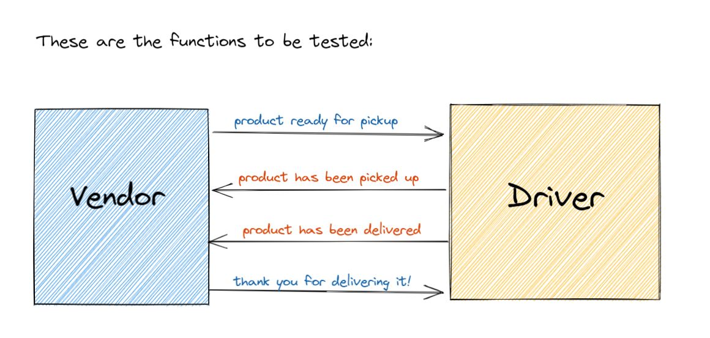

# LAB - Class 12

## Project: capsLab12

### Author: Vida P.

### Links and Resources

- [ci/cd](https://github.com/Vida-1/capsLab12/actions/new)
- [back-end server url](http://xyz.com) (when applicable)
- [front-end application](http://xyz.com) (when applicable)
- [Reading Notes 11 -Event Driven Applications](https://vida-1.github.io/reading-notes/read11_401.html)
- [Reading Notes 12 -Socket.io](https://vida-1.github.io/reading-notes/read12_401.html)
- 
### Setup

#### `.env` requirements (where applicable)

i.e.

- `PORT` - Port Number
- `DATABASE_URL` - URL to the running Postgres instance/db

#### How to initialize/run your application (where applicable)

- npm start

#### How to use your library (where applicable)

#### Tests

- Tests run via GitHub CI upon merge to main branch.

<!-- - Any tests of note?
- Describe any tests that you did not complete, skipped, etc

#### UML-->
